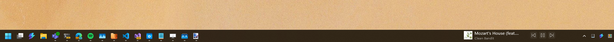

# Deskband 11

A modern resurrection of the Windows <=10 Deskbands, written in WinUI 3 with WASDK. 

> [!WARNING]
> 🏗️ under construction. Hackathon-tier code 🏗️

This works by creating a transparent always-on-top WinUI3 window, and parenting
it to the taskbar. Then we add a clip region to the window to match the
content's size, so it doesn't interfere with other taskbar interactions.

It's literally just a window on top of the taskbar.

I've given it a tray icon too, so you can close it. 

## JSON Extensions

For fun, I've added a JSON-based extension system, so you can create your own
deskband without needing to recompile. To do this, you need to add an
[AppExtension](https://learn.microsoft.com/en-us/windows/apps/desktop/modernize/desktop-to-uwp-extensions)
to your appxmanifest, and point it to a JSON file that describes your deskband.

### Package.appxmanifest changes

Add an extension like this to your appxmanifest, inside the `<Application>` tag:

```xml
<Extensions>
  <uap3:Extension Category="windows.appExtension"> 
    <uap3:AppExtension 
        Name="com.zadjii.deskband" 
        DisplayName="{{Some friendly name for your deskband}}" 
        Id="give-me-a-unique-id" 
        PublicFolder="Public"> 
      <uap3:Properties> 
        <DeskbandProvider>
          <Registration>path/to/your.json</Registration> <!-- path relative to the PublicFolder above -->
        </DeskbandProvider>
      </uap3:Properties> 
    </uap3:AppExtension> 
  </uap3:Extension>
</Extensions>
```

### JSON format

The JSON file you point to should look something like this:

```json
{
    "providerId": "com.zadjii.deskbandJson",
    "deskbands": 
    [
        {
            "id": "another_unique_id",
            "icon": "..\\Assets\\Deskband.png",
            "title": "Test Deskband",
            "subtitle": "I came from JSON",
            "buttons": 
            [
                {
                    "id": "btn-001",
                    "icon": "\uE701",
                    "name": "Bing",
                    "invokeUri": "https://www.bing.com"
                },
                {
                    "id": "btn-002",
                    "icon": "https://github.com/favicon.ico",
                    "name": "Button 2 Tooltip",
                    "invokeUri": "https://www.github.com"
                }
            ]
        }
    ]
}
```

Icons can be anything that Command Palette supports - font icons, local images,
or web images. Relative paths will be evaluated relative to the public folder
you set in the appxmanifest.

`invokeUri` can be any URI that Windows can open. You can make these URI's back
into your app, and handle them there, if you want to do something more complex.

These files don't hot-reload yet. PR's welcome 😄

## `ITaskbarItem` extensibility

Inspired by the Command Palette APIs, there's a simple `TaskbarItemViewModel`
you can extend to create your own deskband. Stick those into the `Bands` object
in `BandsItemsControl`, and we'll display that set of deskbands.

Currently it shows three deskbands:
* A test with buttons
* A hello world label
* the Media Controls deskband, as a recreation of the old
  [AudioBand](https://github.com/AudioBand/AudioBand)

If we wouldn't just totally conflict with windows in the taskbar, I'd add that
straight to the cmdpal API. 
**EDIT**: These no longer conflict with the taskbar items.

These `ITaskbarItems` are created from the JSON extensions above. 

## Direct modification

If you want to put whatever into the taskbar, you can yank out the
`BandsItemsControl` and stick whatever you want into `MainContent` in
`MainWindow.xaml`. The `MainContent` control is what we'll use to clip, so make
sure all your content is inside that.

```xaml
<ContentControl x:Name="MainContent">
    <BandsItemsControl />
    <!-- Replace this ^ with your own content -->
</ContentControl>
```

## Building

You'll need the [Windows App
SDK](https://learn.microsoft.com/en-us/windows/apps/windows-app-sdk/) installed,
and a recent Visual Studio 2022 with the WinUI workload. Then just build and
run. You should see a new window appear on the taskbar.
